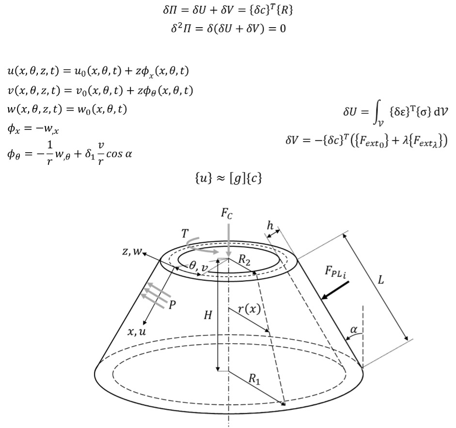

---
site:
  hide_title_block: true
  hide_toc: true
  hide_outline: true
---

+++ { "kind": "split-image" }

## Buckling Handbook

Author: Saullo G. P. Castro

Date: March 23, 2026

Theory and practice on semi-analytical models for buckling and post-buckling.

{button}`Start reading the book </about>`

+++ { "kind": "justified"}

